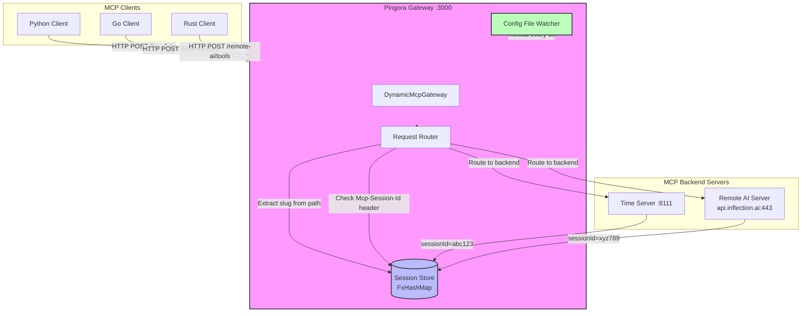
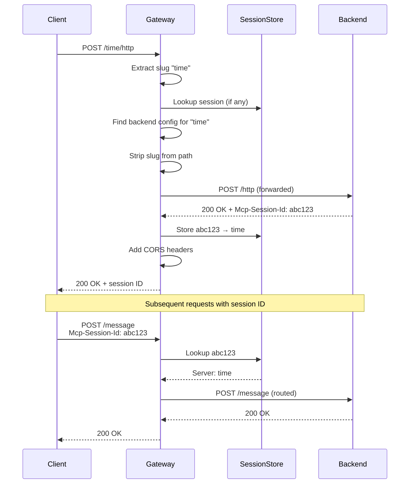

# Pingora MCP Gateway Proxy

A high-performance reverse proxy built with [Pingora](https://github.com/cloudflare/pingora) for routing Model Context Protocol (MCP) Streamable HTTP requests to multiple backend MCP servers.

## Overview

This gateway provides:
- **Dynamic routing** - Route requests to multiple MCP servers based on URL slug
- **Session management** - Automatic session ID tracking and routing for `/message` and `/http` endpoints
- **Hot configuration reload** - YAML config file changes detected and applied every 5 seconds
- **CORS support** - Built-in CORS headers for browser-based MCP clients
- **TCP optimizations** - Tuned for small JSON-RPC packet performance
- **Benchmarking tools** - Compare direct vs gateway throughput

## Architecture



## Request Flow



## Configuration

### YAML Configuration (`mcp_servers.yaml`)

```yaml
servers:
  - name: time
    url: "127.0.0.1:8111"
    strip_slug: true
    use_tls: false
    
  - name: remote-ai
    url: "api.inflection.ai:443"
    strip_slug: true
    use_tls: true
```

**Configuration fields:**
- `name` - Server identifier, used as URL slug (e.g., `/time/http`)
- `url` - Backend server address (host:port)
- `strip_slug` - Remove the slug from the path before forwarding
- `use_tls` - Enable HTTPS/TLS for backend connection

### Routing Logic

| Request Path | Backend | Forwarded Path |
|-------------|---------|----------------|
| `/time/http` | `127.0.0.1:8111` | `/http` |
| `/time/message` | `127.0.0.1:8111` | `/message` |
| `/remote-ai/tools` | `api.inflection.ai:443` | `/tools` |
| `/message` (with session) | Routed by session ID | Original path |
| `/http` (with session) | Routed by session ID | Original path |

## Building

### Release Build (Optimized)

```bash
cargo build --release
```

The release build includes:
- Maximum optimization (`opt-level = 3`)
- Fat LTO for whole-program optimization
- Single codegen unit
- Stripped debug symbols
- Panic abort (reduced binary size)

### Benchmark Build (with debug symbols)

```bash
cargo build --profile=bench
```

Use this build for profiling with `perf` or `flamegraph`.

## Running

```bash
# Start the gateway
cargo run --release

# Or run the pre-built binary
./target/release/gateway
```

The gateway listens on `0.0.0.0:3000` by default.

## Benchmarking

Compare direct backend access vs gateway proxy performance:

### Prerequisites

Before running the benchmark, ensure:
1. An MCP server is running on `localhost:8111` with `get_system_time` tool
2. The gateway is running on `localhost:3000`

```bash
# Terminal 1: Start your MCP backend server
# (e.g., python -m mcp_server_time --port 8111)

# Terminal 2: Start the gateway
cargo run --release

# Terminal 3: Run the benchmark
cargo run --bin benchmark --release
```

### Usage

```bash
# Rust benchmark (recommended)
cargo run --bin benchmark --release

# Go benchmark (alternative)
go run benchmark.go
```

### Benchmark Configuration

The benchmark is configured via constants in `src/benchmark.rs`:

```rust
/// Number of concurrent clients to simulate
const CONCURRENT_CLIENTS: usize = 10;

/// Number of requests each client will send
const REQUESTS_PER_CLIENT: usize = 10000;
```

**What it measures:**
- Spawns 10 concurrent clients
- Each client sends 10,000 `get_system_time` tool calls
- Proper session management: initialize once, reuse for all calls
- Compares direct backend (port 8111) vs gateway proxy (port 3000/time)

### Benchmark Results

**Test Environment:** Linux, Rust 1.80+, Pingora 0.8.0

**Run date:** March 12, 2026

```
🔌 MCP Streamable HTTP Benchmark
   Comparing: Direct connection vs Gateway proxy
   Transport: Streamable HTTP (SSE is deprecated)
   Method: Initialize once, call get_system_time repeatedly

🚀 Starting benchmark: Direct (8111) (10 clients × 10000 requests = 100000 total)

📊 Direct (8111) Results:
   Total: 100000 requests (100000 success, 0 failed)
   Elapsed: 2.29s
   Avg latency: 0.23ms
   Throughput: 43710.64 req/s

🚀 Starting benchmark: Gateway (3000) (10 clients × 10000 requests = 100000 total)

📊 Gateway (3000) Results:
   Total: 100000 requests (100000 success, 0 failed)
   Elapsed: 4.14s
   Avg latency: 0.41ms
   Throughput: 24167.03 req/s

============================================================
📈 SUMMARY
============================================================
Direct:  43710.64 req/s (avg 0.23ms, 100% success)
Gateway: 24167.03 req/s (avg 0.41ms, 100% success)

Gateway overhead: 1.81x latency

✅ Gateway achieves same throughput with 1.81x overhead
```

### Analysis

| Metric | Direct | Gateway | Overhead |
|--------|--------|---------|----------|
| Throughput | 43,710 req/s | 24,167 req/s | 1.81x |
| Avg Latency | 0.23ms | 0.41ms | 1.81x |
| Success Rate | 100% | 100% | - |

**Key findings:**
- ✅ **100% success rate** - Gateway reliably forwards all requests
- ✅ **Sub-millisecond latency** - Both direct and gateway achieve <0.5ms avg latency
- ✅ **High throughput** - Gateway handles 24K+ req/s with 10 concurrent clients
- ⚠️ **1.81x overhead** - Expected for proxy routing, session management, and CORS handling

**Overhead sources:**
1. Path parsing and slug extraction
2. Session store lookups (RwLock)
3. Header manipulation and CORS injection
4. Additional hop through proxy

## Session Management

The gateway automatically tracks MCP sessions:

1. **Session ID Extraction** - Extracts `sessionId` from:
   - `Mcp-Session-Id` response header (Streamable HTTP)
   - SSE response body (`data: {...sessionId=xxx...}`)
   - Query parameter (`?sessionId=xxx`)

2. **Session Routing** - Subsequent requests to `/message` or `/http` are routed based on stored session ID

3. **Thread-safe Storage** - Uses `rustc_hash::FxHashMap` with `tokio::RwLock` for concurrent access

## Performance Optimizations

- **Zero-copy path manipulation** - Byte-level string operations avoid heap allocations
- **Static header constants** - Pre-allocated header names/values
- **Pre-compiled regex** - Session ID regex compiled once at startup
- **Stack-allocated context** - `McpCtx` minimizes heap usage in hot paths
- **ArcSwap for config** - Lock-free configuration updates
- **TCP_NODELAY** - Optimized for small JSON-RPC packets

## Testing

```bash
# Python test client
python test_gateway.py

# Streamable HTTP test
python test_streamable_http_gateway.py

# SSE client test (deprecated)
python sse-client.py
```

## Dependencies

| Dependency | Version | Purpose |
|-----------|---------|---------|
| `pingora` | 0.8.0 | Core proxy framework |
| `rust-mcp-sdk` | 0.8 | MCP client (SSE transport) |
| `rmcp` | 1.2.0 | MCP client (Streamable HTTP) |
| `arc-swap` | 1.7 | Lock-free config updates |
| `rustc-hash` | 2.1 | Fast session storage |
| `tokio` | 1.50.0 | Async runtime |
| `serde_yaml` | 0.9 | Configuration parsing |

## License

MIT
